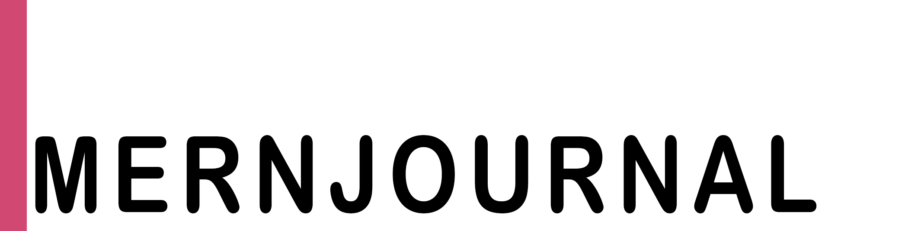

Introducing MERNJournal!  
The ultimate note-taking application designed to revolutionize the way you capture, organize, and recall your thoughts! 
Take control of your thoughts, enhance your productivity, and unleash your creativity with the power of MERNJournal!
Don't settle for ordinary note-taking apps -
Upgrade to MERNJournal and unlock a world of limitless possibilities!

## Table of Contents

- [Table of Contents](#table-of-contents)
- [Installation](#installation)
- [Usage](#usage)
- [License](#license)
- [Contributing](#contributing)
- [Contributors](#contributors)
- [Questions](#questions)

[Heroku](https://gentle-chamber-06355.herokuapp.com/)

MERNJournal is a fullstack note-taking application created by [ruchiagarwal26](https://github.com/ruchiagarwal26), [jmcavaddy](https://github.com/jmcavaddy), [Olloyd](https://github.com/Olloyd321),  [Harrison Zussman](https://github.com/HarrisonZussman), and [William Hirst](https://github.com/FreeWill201) with the end goal being a refined, refactored note taking application that is an improvement on our previous note taker applications.

Login/SignUp page :


Entry page:


USER STORY 
```
GIVEN a MERN based note-taking application
WHEN I open MERNJournal 
THEN I am presented with a landing page with a link to a notes page and a signup/login page
When I click on Signup/login button
Then I get toggle between signup and login options
When I click Sign up
Then I am presented options for input email, username and password
When I click on login
Then I can enter username and password
When I am logged in
Then I get option to create notes
WHEN I click on ‘notes’
THEN I am presented with a page with existing notes 
WHEN I submit a new note title and text
THEN a Save icon appears 
WHEN I click on the ‘save’
THEN the new note I have entered is saved and appears 
WHEN I click on an existing note
THEN the same note appears elsewhere on the page
```
## Technologies used

This project is built on MERN stack. Major technologies used are:
* MongoDB
* Express
* React
* Node Js
* Graphql
* JWT
* CSS
* bootstrap

## Installation 

To install dependencies run the following command: 

```

npm install
npm run develop

```

## Usage 

A useful note-taking application designed for the user to be able to create their own profile and keep track of specific notes that they deem important. This is made with students in mind along with all other professions that require the ability to save important information to be referenced later. 

## Future Development

```
Capabilities to add profile pictures and other bookmarks to Notes

Seamless connection between multiple devices and platforms of using MERNJournal

Implement google's ‘speech to text’ API https://cloud.google.com/speech-to-text

Advanced Search and Filters: Enhance the search functionality by adding advanced filters, such as date ranges, tags, or specific notebook sections. 

```

## License 
  
This Project is licensed under the MIT license.

## Contributing

Contributions welcome please message a contributor below.

## Contributors

[ruchi](https://github.com/ruchiagarwal26), [John Mcavaddy](https://github.com/jmcavaddy), [Olloyd](https://github.com/Olloyd321), [Harrison Zussman](https://github.com/HarrisonZussman), [William Hirst](https://github.com/FreeWill201)

## Questions

For any questions on this project please email , or contact us on github - [ruchi](https://github.com/ruchiagarwal26), [John Mcavaddy](https://github.com/jmcavaddy), [Olloyd](https://github.com/Olloyd321), [Harrison Zussman](https://github.com/HarrisonZussman), [William Hirst](https://github.com/FreeWill201).
